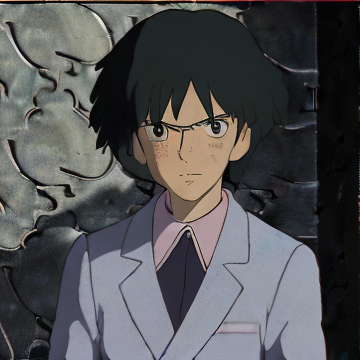
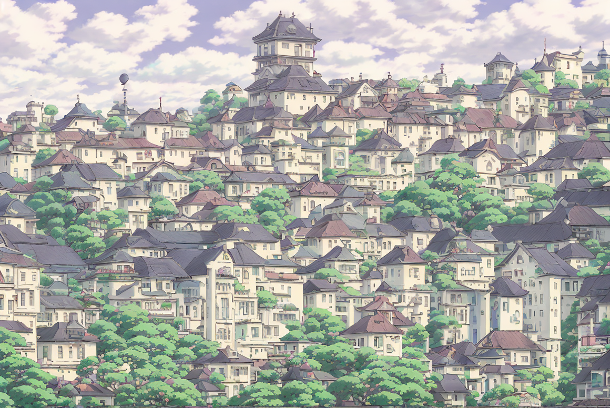

# Ghiblify

Full-stack application to converts photos into Studio Ghibli style artwork using Stable Diffusion

<table>
  <tr>
    <td>
      
    </td>
    <td>
      
    </td>
  </tr>
  <tr>
    <td>
      
    </td> 
    <td>
      
    </td>
  </tr>
</table>
