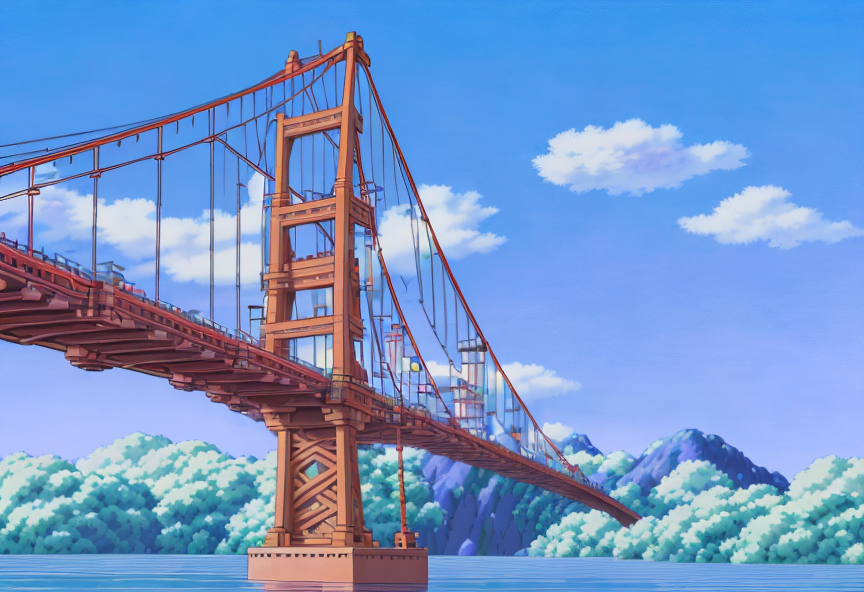
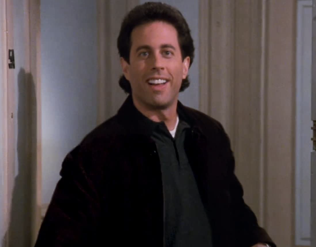
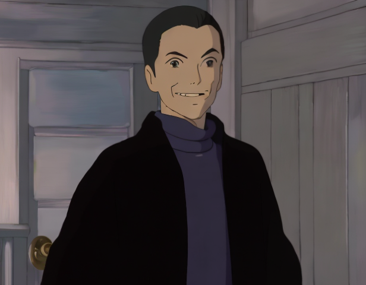

# Ghiblify

A full-stack application to converts photos into Studio Ghibli style artwork using Stable Diffusion. The frontend is built using ReactJS and ChakraUI. The backend relies on a fine-tuned Stable Diffusion, made avaialble by Stability AI. This project utilized an Image to Image piepline with text prompt guidance.

A delopyed version of the frontend without a connection to the Stable Diffusion component is availble here: https://ghiblidiffusion.vercel.app

<h4> Examples (Before → After) </h4>
<table>
  <tr>
    <td>
      
    </td>
    <td>
      
    </td>
  </tr>
  <tr>
    <td>
      
    </td> 
    <td>
      
    </td>
  </tr>
</table>
